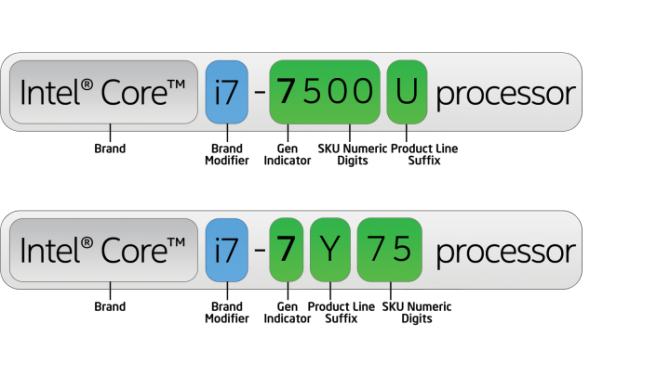
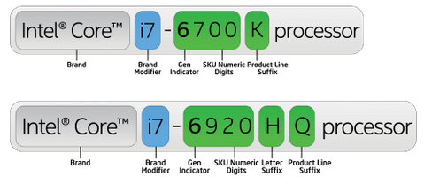
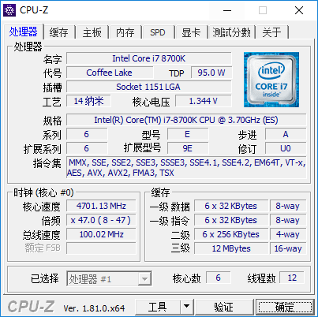

# CPU
CPU 中文全称叫做中央处理器，是英文 Central Processing Unit 的缩写。CPU 是计算机的大脑，它决定计算机的处理速度，计算机由它来控制所有的行为。

目前两大生产厂商是 AMD 和 Intel，后者可能大家比较熟悉 ---- 英特尔，英特尔的市场占有率也远远高于 AMD[^1]。

影响CPU运行速度的主要因素有主频，核心，线程，缓存，架构等等，对于普通消费者主要关注架构，主频和核心数量这三个重要的参数即可。这三点也是所有CPU厂商在宣传时主要侧重的因素。

因为主流市场主要是英特尔的酷睿 i 系列，所以本文主要以 Intel 作为介绍。其他更多的型号可以参考[斯坦福大学维护的CPU数据库](http://cpudb.stanford.edu/)

对于笔记本而言，通常情况下用户也不会自信更换CPU，所以更要在购买时选择一款合适的处理器。现在就来看下市面上主流的处理器型号中的各种参数含义。

酷睿 CPU 型号中各个参数的含义：

举例说，比如 i5-8250U

- 其中 i5 是处理器的定位级别，常见的还有 i3, i7, i9 等等，这是英特尔酷睿CPU的定位，可以简单的理解为数字越高越好。
- 后面的四位数字 8250，第一位 8 表示的是处理器的迭代次数，8 表示第8代产品，后三位表示的是同一代产品的性能差别，越大越强劲
- 最后的字母 U，表示的CPU的定位

最后一位字母一般来说有如下的可能：

- H 表示标压，不可拆卸处理器
- Q 表示四核心处理器
- K 表示可超频处理器，不锁倍频版本
- S 表示节能版，默认频率比标准版稍低，但是睿频幅度和标准版一致
- T 表示超低功率版本，主打节能
- U 表示低电压处理器
- X 表示台式机顶级处理器
- Y 表示超低电压处理器

各个 CPU 性能的比较可以参考这些网站

- <https://notebookspec.com/cpu/>

通常情况下如果是游戏玩家会推荐标准电压版，也就是 CPU 结尾带 H，而如果是普通办公学习，结尾 U 的低电压版本因为比较节能而推荐。

对于 i5 或者 i7 的选择，如果是专业用途，需要大量 CPU 计算，那么毫无理由用 i7，否则在同一代产品中，i5 的性能也完全足够。

最后如果还想继续了解 CPU ，那么有几个通用的衡量 CPU 的参数读者可能需要了解一下，核心，主频。

## 核心 Core
平时我们听到最多的宣传就是几核几核处理器，最早的时候一块 CPU 只有一个核心，为了提高 CPU 的性能，生产厂商就尝试在一块 CPU 上安装额外的核心，所以形成了双核，四核，甚至八核处理器等等。

在计算机领域，线程是CPU执行任务的最小单位，单个核心在同一个时间只能执行一个线程。

    物理 CPU 核心数 = 物理 CPU 个数 × 每颗物理 CPU 的核心数
    逻辑 CPU 核心数 = 物理 CPU 个数 × 物理 CPU 核心 × 超线程数
    
### 超线程 Hyper-Threading
超线程技术是英特尔首次尝试将并行计算带到消费者PC市场，首次发布是在 2002年桌面版 CPU Pentium 4 HT 上[^2]。Pentium 4 那时候只有一个 CPU core，所以当时的 CPU 尽管可以通过快速切换任务来模拟多任务。但同时只能处理一个任务。

通过超线程技术使得同一个物理 CPU core 可以模拟两个逻辑 CPU(logical CPU)，从而“欺骗”操作系统，让操作系统认为有两个 CPU 而来达到提高运行速度。

超线程技术允许两个逻辑 CPU 核心共享物理资源，举个例子，如果一个虚拟核心正在等待，那么另外一个虚拟核心可以借用一些资源来。超线程可以用来提高运行速度，但是也无法和额外的物理核心去比较。
    
所幸的事，现在英特尔的技术可以让多核心和超线程同时运作，所以经常会听到双核（dual-core）四线程，四核（quad-core）八线程这样的词。

比如在我的电脑上，使用 linux 的命令可以查看 CPU 详细信息：

    cat /proc/cpuinfo| grep "physical id"| sort| uniq| wc -l
    
只有一块 cpu

    cat /proc/cpuinfo| grep "cpu cores"| uniq
    
但是这块 CPU 有 4 个核心

    cat /proc/cpuinfo| grep "processor"| wc -l
    
每个核心通过超线程能跑两个线程，所以称为 4 核 8 线程。    

线程数越多，电脑同时运行的程序越多，线程数等同于在某个瞬间 CPU 能同时并行处理的任务数。线程数是一种逻辑的概念，简单地说，就是模拟出的 CPU 核心数。

## 主频 或者 时钟频率 {#clock-rate}
CPU 厂商在发布 CPU 时总会公布其基础频率，也就是常说的主频，这个频率指的是 CPU 内部的数字时钟信号频率，时钟频率是同步电路中的基础频率，表示的是每秒时钟周期，频率越高，表示的也就是 CPU 在每秒中产生的脉冲信号越多。

CPU 的主频并不能代表 CPU 的真实运算速度，但是提高主频对于提高计算机运算速度却是至关重要的。举个例子来说，假设某个CPU在一个时钟周期内执行一条运算指令，那么当CPU运行在1GHz主频时，将比它运行在500MHz主频时速度快一倍。因为1GHz的时钟周期比500MHz的时钟周期占用时间减少了一半，也就是工作在1GHz主频的CPU执行一条运算指令所需时间仅为1ns比工作在500MHz主频时的2ns缩短了一半，自然运算速度也就快了一倍。

    主频=外频 × 倍频

### 外频
CPU在诞生后不久，各大 CPU 巨头为了追求高性能，开启了频率大战（有没有效果这个我们先不提），但是这样一来，CPU虽然跑得更换了（主频更高），但是外部的主板芯片组、内存、外部接口（PCIe、Sata）可还是处于旧有标准，而且这些设备的运行频率早就固定下来了，并且远低于CPU工作频率。这样一来CPU就无法很好与之交流，Intel就机智地提出了倍频的概念（下面讲述），并且提出了影响至今的一个CPU主频计算公式

    主频=外频 × 倍频
    
外频的提出可以让主板外部的设备工作在较低的频率下，并且还能正确地CPU进行交流。

### 倍频
    
目前的CPU设计的外频都相当低，只有100MHz，CPU要获得更快运算速度，我们就需要获得一个超高速的频率来支撑更快运算速度。而CPU通常就是在内部设计有一个锁相环频率发生器，对于输入的时钟信号进行分频处理，按照一定比例提高输入的外频频率，从而得到CPU的实际工作频率，这个比例就称之为倍频系数（简称倍频）。
    
利用倍频技术, 较为完美地解决了CPU和内存等数据中转站的异步运行问题。为CPU后来向更高频率方向发展打下了扎实的基础。 
    

### 查看 CPU 主频的方法
一般情况下 CPU 或者笔记本在售卖时就会将主频标注在显眼的位置。如果已经开机的计算机可以使用一款叫做 CPU-z 的软件可以查看 CPU 详细的信息。

### 英特尔睿频加速技术
英特尔睿频技术是英特尔发布的自动超频技术，当开启睿频加速之后，CPU会根据当时的任务自动调整 CPU 的主频，从而达到繁重任务时发挥最大的性能，而轻任务时发挥最大的节能优势。

### Turbo Boost 频率
拥有Turbo Boost技术的CPU每一个核心都有自己的PLL（Phase Locked Loop，锁相环）电路，这样每个核心的电压和频率都可以独立控制，为此Intel专门在CPU内部设计了PCU（Power Control Unit，功耗控制）单元，PCU会以1ms（每秒1000次）的速度实时监测这四个核心的温度、电流及功耗等参数，因此又有Turbo Boost频率可以根据负载需要调整CPU的频率。同时由于参与到运算的核心数越多，控制起来就更为复杂，所以一般核心数目越多，能达到最高频率越低。

### 超频
超频指得是电脑操作者通过技术手段将 CPU 工作频率提高，让其在高于额定频率下稳定工作，以提高电脑工作速度。超频不仅可以在 CPU 上进行，在内存，GPU上都有相应的技术手段。以 CPU 为例，生产厂商在出厂时，已经对 CPU 进行了复杂的测试，并标记了 CPU 在稳定工作时的最高频率，但是有的时候为了保证 CPU 质量，所以在标记主频时可能会可以标底，比如工作在 2500MHZ 的 CPU 可能在 3500MHZ 下仍然能够稳定工作。

睿频加速过程中出现的 CPU 故障可以保修，而人为超频出现的损坏不在质保范围；睿频加速是自动实现，而超频需要用户手动调整 CPU 各种指标，比如电压，外频，散热，电源等等。

## reference

- <https://en.wikipedia.org/wiki/Clock_rate>
- CPU 频率 <http://www.expreview.com/57334.html>
- <https://www.laptopmag.com/articles/cpu-comparison>

[^1]: https://www.cpubenchmark.net/market_share.html
[^2]: https://www.howtogeek.com/194756/cpu-basics-multiple-cpus-cores-and-hyper-threaing-explained/
