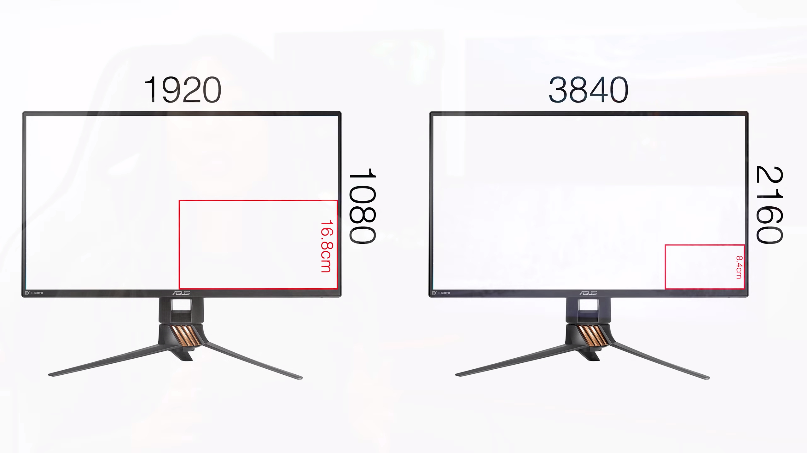
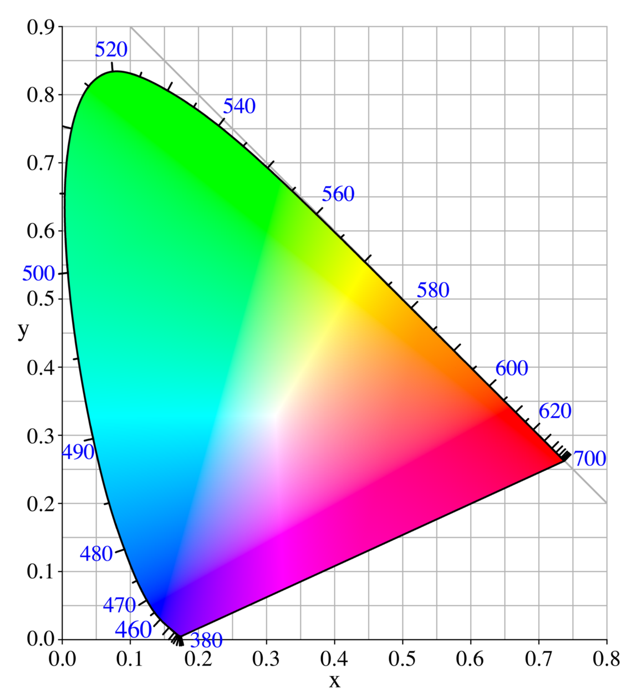
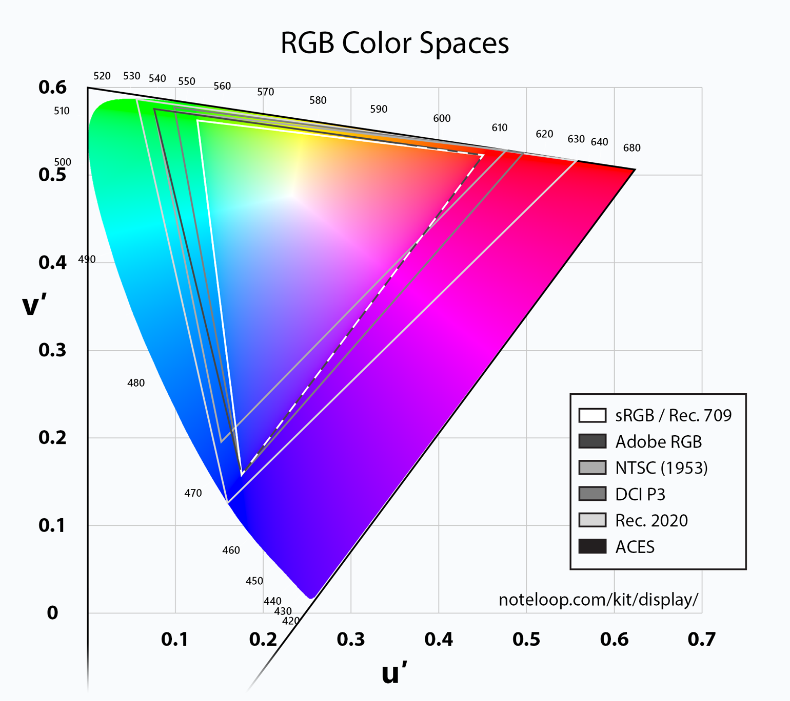

# 显示器

或许想到显示器很多人脑海中会弹出 Apple 对于显示器的痴迷态度，Retina 屏幕的显示效果真的非常棒。但是对于大部分的 PC 机，1080p 的屏幕已经能够满足日常使用需求。建议的最小屏幕分辨率需要 1920*1080 ，更多关于分辨率的知识可以参考下面分辨率部分。

说完分辨率另外一个就是屏幕大小尺寸，目前市场上主流的笔记本，有12寸，13寸，15.6寸，对于绝大多数用户，13寸是一个比较合适的尺寸，如果不嫌体积大小，那么15.6寸的电脑能给你更宽的屏幕。

另外对于屏幕的可视角度，大部分的笔记本在使用时可能都是坐在电脑正前方使用，对于可视角度要求可能并不高，但如果你特别在意可视角度，那么可以选择可视角度更加广的 IPS 屏幕。

对于色域来说达到 100%sRGB / 72%NTSC以上色域的屏幕，就属于不错的屏幕。

另外目前越来越多的PC厂商会将触摸控制放到电脑屏幕上，虽然这是一个加分项，但是也要根据自身的需求决定是否需要这块触摸屏。

## 屏幕大小
常见的屏幕大小有 12， 13.3， 15.6 寸等等

屏幕大小也决定了整个笔记本电脑的大小，虽然目前笔记本边框越做越窄，但是笔记本的大小依然由屏幕的大小而决定，如何选择屏幕大小就需要依据自身的实际情况而决定了。对于一般工作学习，而又不想要负重很多的读者来说13到15寸应该是一个不错的选择。

如果想要实际感受屏幕大小可以到附近的大型商场中体验不同屏幕大小带来的区别。

## 分辨率
分辨率，又被翻译为解析度，指的是显示器中像素点个数，以最常见的 1080p 举例，也就是显示器宽度有 1080 个像素，而高有1080个像素点。所以分辨率越高，图像显示就越细腻，质量就越高。

常见的分辨率

缩写        | 实际分辨率
------------|-----------------
HD 或 720p  | 1280*720 （16:9）
Full HD 或 1080p   | 1920*1080 (16:9)
WUXGA       | 1920*1200 (16:10)
2K          | 2048*1080
QHD         | 2560*1440
Ultra HD    | 3840*2160
4K          | 4090*2160

目前笔记本中常见的也就是 1080 和 少量的 2k 屏幕，也有一些非常规设计，比如 surface book 的 3000*2000，或者是 Macbook 13 寸的 2560 * 1600

笔记本       | 分辨率
-------------|-----------
Retina      | 2560*1600	 2880*1800	
Surface book  | 3000*2000

再举一个更加直观的例子，比如在同样大小的显示器中，显示同一张图片，那么视觉上的大小会有很大的差别。

## 屏幕的类型

### IPS
IPS 全称是 In-Plane-Switching Liquid Crystal 横向电场效应显示技术，是日立制作所于1996年开发的LCD广视角技术，被广泛的使用在液晶电视及平板电脑的制造上。对于 IPS 的技术原理过于复杂，可以参考[这里](http://notebook.pconline.com.cn/997/9976847_all.html)
 
优点：

- 硬式面板，很适合做成受压的触控屏幕
- 在明亮的户外灯或阳光直射下， IPS 屏幕更易于查看或阅读， 因为有内置背光
- 色彩和可视角度好于 TN 屏幕
- 符合业界的色彩标准，色彩还原度高

 
### VA 屏幕
VA 屏幕全称 Vertical Alignment，VA 屏幕也属于软屏，用手指按压也会出现纹路。

优点：

- 正面对比度高
- 色彩还原准
- 可视角度大

缺点：

- 功耗高
- 响应时间高
- 面板均匀性差
 
### TN 屏幕
TN 屏幕为 Twisted Nematic，
用手按压TN面板屏幕的话，会产生明显的水波纹

优点：

- 不错的色彩
- 很好的亮度
- 很少漏光
- 更容易实现高响应速度
- 刷新率可以达到 240 Hz

TN 屏不是设计为垂直使用的，如果想要将屏幕竖直起来使用，那么选择 VA 或者 IPS 屏幕。

总结来说，如果使用屏幕用来浏览网页，购物，编写文档，看视频，那么使用便宜的 TN 屏幕即可，如果是动作游戏玩家，希望屏幕有很快的响应速度，那么可以选用一块高刷新率，高响应速度的 TN 屏幕。

如果使用屏幕观看非常多的视频，电影，或者玩画面非常精美，但是动作场面不是那么复杂的游戏时，VA 屏幕是不错的选择。

如果经常和朋友一起聚会观看视频，电影，或者你是内容创建者，包括摄影工作者，视频制作者，设计师等等需要非常准确的识别色彩的人，那么 IPS 屏幕是很好的选择。

### LCD 和 LED 区别
在显示技术中， LCD 和 LED 常被拿来比较：

- LCD（液晶显示器 Liquid Crystal Display）：液晶显示器不会产生自己的光; 这是通过额外背光或者侧光完成显示。液晶显示屏对比度高，视角宽广。
- LED（发光二极管 Light Emitting Diode）：一种从电能产生光的半导体器件。LED通常用于背光LCD显示器, 将光线从背面照射，从而产生清晰的图像。

目前大多数的显示屏都是 LED 技术。

## 刷新率
刷新率指即每秒钟屏幕画面的刷新次数，刷新率的单位是赫兹(Hz)。 如果屏幕的刷新率为75 赫兹，就是说屏幕上的画面每秒钟被刷新75 次。通常来说刷新率越高，画面月流畅。

如果不玩游戏，那么刷新率其实不是很重要，但如果你是重度游戏玩家，尤其是经常玩画面变化比较快，或者动作场面比较大的玩家，那么一块高刷新率的显示器必不可少。至少 60 Hz 或者 120 Hz。

不过要记住一点，至少电脑能够带动那么高刷新率的游戏，或者游戏支持那么高的刷新率，否则屏幕就是浪费了。

## 响应时间
通常来说 10ms 一下的显示器已经完全足够，大部分的笔记本电脑都不会将显示器的响应标注出来，不过目前的技术水平，不管是 TN 屏幕还是 IPS 屏幕都能够将响应时间缩小到 10ms 以下，所以不用太担心。

## 色域
色域是对一种颜色进行编码的方法，也指一个技术系统能够产生的颜色的总合，色域是屏幕能够显示的色彩范围，同一个色彩空间中，色域覆盖范围越广，色彩显示范围越广。
               
### 色彩管理标准
1931年国际照明委员会（CIE）的颜色科学家们在RGB模型基础上，用数学的方法从真实的基色推导出理论的三基色，创建一个新的颜色系统，使颜料、染料和印刷等工业能够明确指定产品的颜色，这就是 CIE 1931 色彩空间

我们常听说的 sRGB， NTSC， AdobeRGB 都是在这个大范围色彩空间上的小范围色彩空间。

### sRGB
sRGB是惠普和微软在1996年共同创造的色彩空间，也是目前Windows系统和众多原生软件默认支持的色彩空间

### Adobe RGB
Adobe RGB是专业软件生产商Adobe在1998年推出的色彩空间，初衷是为了同时囊括sRGB（电脑常用的色彩空间）和CMYK（印刷常用的色彩空间），这样拍出的数码照片不仅能在电脑上正常显示和编辑，也能印刷出颜色无损而正确的相片。Adobe RGB相比sRGB囊括的色彩范围更广，受到设计师的青睐，因此在专业的摄影和后期领域被广泛使用。

### NTSC色域
是NTSC电视标准下的色彩空间。NTSC是美国国家电视标准委员会，他们所推出的NTSC电视标准是一套广播电视传输协议，被运用在美国、日本等国家的广播电视系统中。当然这也就意味着，NTSC色彩空间更多被运用在电视行业。
    

大致判断：

- 达到 100%sRGB / 72%NTSC以上色域的屏幕，属于不错的屏幕
- 达到 90%AdobeRGB / 90%NTSC以上的屏幕，属于非常优秀的屏幕
- 如果一个屏幕的色域只有 65%sRGB 或者 45%NTSC 的话，那这个屏幕就是非常垃圾的屏幕

对于有平面设计、图像处理等需求的人来说，一块高色域的屏幕是非常重要的。

## reference

- <https://www.noteloop.com/kit/display/color-space/>