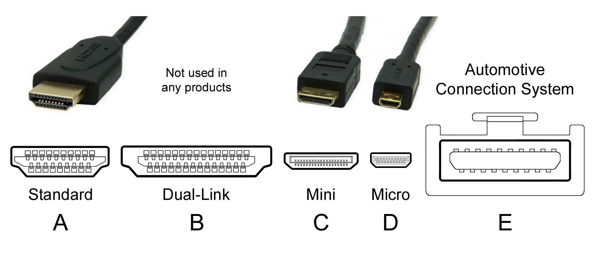
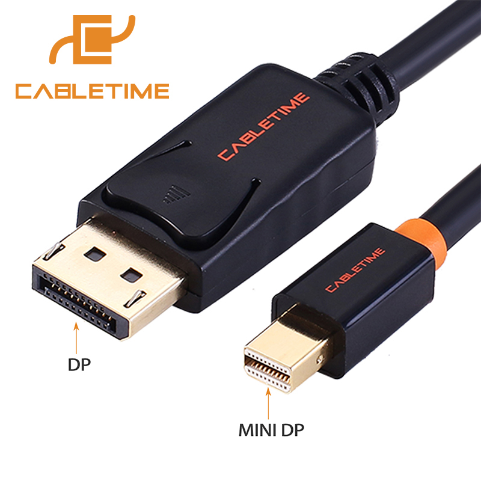

# 显卡
显卡又被成为图形处理器，英文可以叫做 GPU，或者叫做 Video Card 或者 Graphics Card。

显卡分为核显（集成显卡）和独显（独立显卡）

核显集成到 CPU 中，这种显卡只能满足日常使用需求，不足以带动大型3D游戏。独立显卡是单独安装在电脑中的显卡，一般用来驱动游戏。

目前显卡的两大生产厂商 NVIDIA 和 AMD，曾经的 ATI 被 AMD 收购了。所以会见到很多人简称 N 卡和 A 卡，分别代指的就是 NVIDIA 的显卡和 AMD 的显卡。

对于绝大多数非游戏玩家在选购笔记本时，显卡绝大多数情况下能够应付日常生活工作，如果你是游戏玩家在选择笔记本时，可以了解一下当前笔记本使用的是否是最新一代的显卡产品，按照显卡的名字去网上搜索一下该显卡的处理能力，基本就能够决定是否值得。
 
## 显存
显存：也被叫做帧缓存，它的作用是用来存储需要 GPU 处理过或即将提取的数据，如同计算机的内存一样，显存的主要参数有：显存类型、容量、位宽、频率。

显存不是显卡的决定性因素，不是显存越大显卡越好，显存在特定情况下才会发挥最大的优势，比如玩大型游戏需要加载复杂场景时，因为本人对显卡了解并不是非常深入，所以这里也只能讲一个大概。

## 型号区别

对于英伟达的显卡，目前主流的命名方式是 GTX 接一串数字和字母。

图来自 [Reddit](https://www.reddit.com/r/pcmasterrace/comments/4wzer6/i_made_a_chart_explaining_amd_and_nvidias_gpu/)

- 其中第一位，或者前两位表示第几代产品
- 后两位是显卡的性能定位
- 后缀部分有 M 和 Ti，M 是为移动平台推出的产品，而 Ti 版要比普通显卡强劲

举例来说，比如 GTX 1050Ti

- GTX 品牌的称呼，还有四种性能依次降低 GTX > GTS > GT > GF 
- 1050 中，10表示的显卡代数，10 就是10代显卡，50 表示的是显卡性能定位，1060 就要比1050要强
- 后缀字母 Ti

    Ti 性能加强版
    m 移动端显卡
    mx 移动加强版
    SLI 后缀表示可以通过特殊接口将显卡并联提高工作性能
    Max-Q 后缀表示该显卡是 Max-Q 设计方案，调整了硬件让新显卡能够放到轻薄本中

英伟达还有一些 MX150 这种显卡，这是英伟达为轻薄本推出的显卡。
 
## 接口类型

### VGA
VGA 接口全称 Video Graphics Array，VGA 接口早老一代主机和笔记本上最常见，如图上所示，外口为 D 形，三排，每排五个孔。VGA接口扩展性比较强，所以曾经一度占领市场，但是因为其接口大小限制，目前正在被 HDMI，DP 口逐渐替换。

VGA 接口在1987年被提出时，当时的计算机显示技术还停留在模拟信号阶段，后来发展出液晶显示技术，VGA 在接口转接可能会造成图像画面损失。

### DVI 接口
DVI 全称是 Digital Video Interface，DVI 接口也和 VGA 接口一样正逐渐被代替。

### HDMI 接口
HDMI 接口全称 High Definition Multimedia Interface，HDMI 标准是几家行业巨头形成的标准。

HDMI接口的优势HDMI不仅可以满足1080P的分辨率，还能支持DVD Audio等数字音频格式，支持八声道96kHz或立体声192kHz数码音频传送。

HDMI 标准中定义了下面几类接口标准，不同的类型大小和传输速率有一定的影响[^hdmi]

[^hdmi]: https://en.wikipedia.org/wiki/HDMI

不同的 HDMI 标准传输速率也不相同，大体可以看下图，随着 HDMI 标准的发展目前最新的 HDMI 2.1 标准最大理论支持传输带宽是 48Gbps

### DP 接口
 DP接口全称 DisplayPort 接口，有全尺寸 DP 和 mini DP 接口两种类型。和 HDMI 标准的形成不同，DP 接口是 Video Electronics Standards Association 控制，和 HDMI 收费不同，DP 接口是免费授权。
 
 
 
 
 标准        | 传输带宽 
 -----------|------------
 DP 1.1     | 10.8 Gbps
 DP 1.2     | 21.6 Gbps
 DP 1.3/1.4 | 32.4 Gbps
 
 可能大家对这个数据没有概念，这样举个例子吧，High Definition 也就是 1080p 60 fps，需要带宽大概是 4.45 Gbps，4K 60fps 大概是17 Gbps 左右。
 
 ## reference
 
 - <https://www.notebookcheck.net/Comparison-of-Laptop-Graphics-Cards.130.0.html>