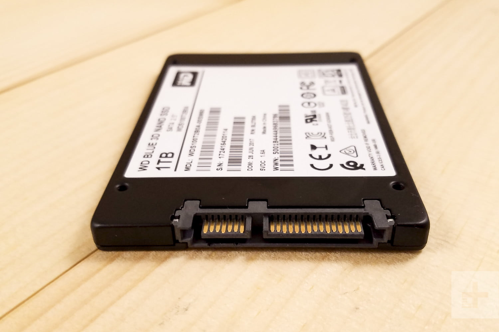
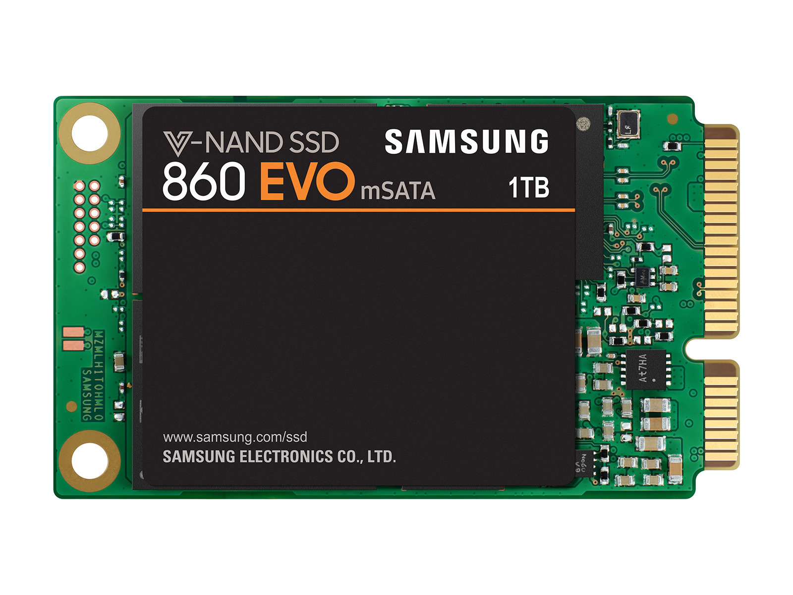
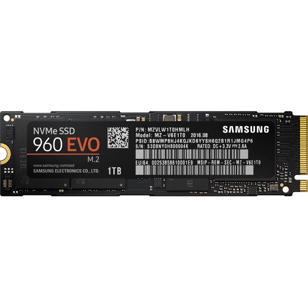

# 硬盘
上一节说到内存，这里就不得不提硬盘，内存虽然存取速度快，但是无法保存数据，一旦断电所有内存中的数据就会丢失，所以需要硬盘来将有用的数据保存下来。

硬盘对于笔记本也非常重要，目前市场上有两类硬盘，一类是 SSD 固态硬盘，一类是机械硬盘。固态硬盘因为其读写速度目前正在慢慢取代机械硬盘，但是因为其价格高昂，所以目前大部分家用或者个人用计算机只会将系统安装在固态硬盘中，从而加速电脑的运行，而普通资料则还是保存在价格低廉的机械硬盘中。

对于绝大多数的 PC 机，目前主流的配置基本上已经是 128G 固态，或则 256 G 固态，再加上1T 或者更大的机械盘作为标配了。

## SSD
SSD 全称叫做 Solid-state drive，是以闪存作为永久性存储器的设备。

NAND 闪存在多个保存 bits 的单元上组建起来，这些 bits 通过充电来表示开关，以此来存储数据。每一个单元中的 bits 个数也决定了这些单元颗粒的名字，比如说 SLC 就是 Single Level Cell 每一个 cell 包含一个 bit 。

### 闪存颗粒
闪存颗粒，又称闪存，是一种非易失性存储器，即在断电的情况下依旧可以保存已经写入的数据

#### SLC (Single Level Cell)

SLC 因其 single bit 位可以在充电时打开或关闭而得名。 这种类型的闪存在读取和写入数据时准确，并且还具有持续最长数据读取和写入周期的优点。 程序读/写生命周期预计在 90,000 到 100,000 次之间。 由于其寿命，准确性和整体性能，这种类型的闪存在企业市场中表现非常出色。由于其高成本和低存储容量，很少看到具有此类NAND的家用计算机。

优点：

- 具有最长的寿命
- 更可靠的读/写错误控制
- 可以在更宽的温度范围内运行

缺点：

- 通常很昂贵
- 通常容量很小

推荐给工业，专业领域使用，或者是需要大量读写的服务器使用

#### eMLC (Enterprise Multi Level Cell)
eMLC是MLC闪存，但针对企业部门进行了优化，具有更好的性能和可持续性。 读/写数据生命周期预计在20,000到30,000之间。 eMLC提供了一种较低成本的SLC替代方案，同时保留了SLC的一些优点。

优点：

- 企业级SSD比SLC更便宜。
- 与标准MLC相比具有更好的性能和耐用性。

缺点：

- 在性能上与SLC NAND闪存SSD不匹配。

推荐给工业，专业领域使用，或者是需要大量读写的服务器使用

#### MLC (Multi Level Cell)
MLC闪存，因为在一个单元上存储 multi bit 数据而得名。这方面的最大优点是制造成本低于制造 SLC 闪存。闪存生产成本低，MLC 闪存是消费者 SSD 的首选，但与SLC相比，数据读/写寿命较少，每个单元约10,000 次。

优点：

- 生产成本低
- 比 TLC 颗粒更加可靠

缺点：

- 不像SLC或企业级SSD那样耐用可靠。

推荐给普通消费者，包括游戏玩家，发烧友等

#### TLC (Triple Level Cell)

每个单元存储 3位，TLC闪存是制造闪存最便宜的形式。 这种硬盘的最大缺点是它只适合消费者使用，并且不能满足工业用标准。 读/写生命周期相当短，每个单元3,000到5,000个周期。

优点：

- 便宜

缺点：

- 与MLC NAND相比，单元将在相当少的读/写周期中存活。 这意味着TLC 仅适合消费者使用。

推荐普通消费者

### 总结
如果日常存储音乐，图片，安装软件，编写个人文档等用途，通常情况下 SSD 可以持续数年，而不用担心 SSD 的生命周期。而如果平时处理有大量的读写硬盘操作，那么一定要注意时常观察 SSD 的状态以及及时备份数据。[^1]

## 机械硬盘

### SATA 接口
Serial ATA 接口，采用点对点的方式实现了数据的分组传输从而带来更高的传输效率。

SATA是为HDD设计的接口，最大带宽是6Gb/s，理论传输速度是最高600MB/s

### mSATA 接口
mSATA接口是SATA的衍生产物，其传输协议完全照搬SATA，其诞生目的主要是为了缩减SSD存储设备体积，最早用于笔记本产品，可以显著节省笔记本内部空间占用。

mSATA刚诞生时，受到了不少笔记本厂商的欢迎，后续在一些主板上也有提供，但很快就没落了，市面上新出的主板已经完全抛弃了这一接口，其原因是新出的主板诸如Intel 9、100系列可以提供传输速率更快的M.2接口。SSD的小型化节约的空间并没有对用户带来多少好处，性能传输依然被限制在6Gbps，另外mSATA小巧的体积使得其很难满足大容量SSD闪存颗粒的布置需求。再加上Intel心意已决要淘汰掉这种接口，mSATA只能是未绽放便凋零。

### M.2 接口
M.2接口也就是NGFF（Next Generation Form Factor），产品主要优势是传输速率快和体积小巧，对应的存储设备可以直接固定在主板上，现在的Intel 9系、100系列主板上几乎都标配了这一接口，Intel主推这一接口主要是为了取代此前的mSATA接口。

最高传输带宽可达32Gbps

[^1]: https://www.mydigitaldiscount.com/everything-you-need-to-know-about-slc-mlc-and-tlc-nand-flash.html