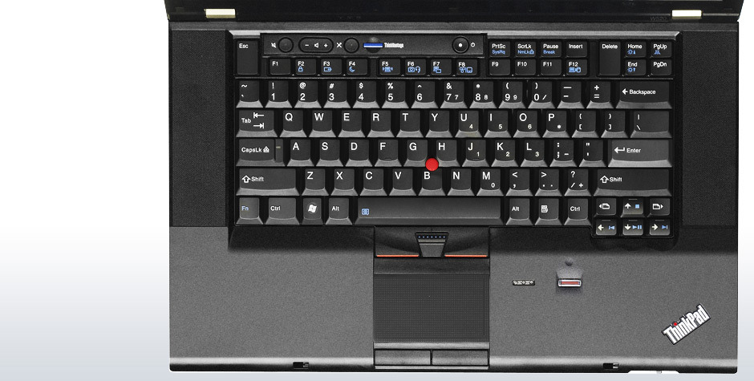
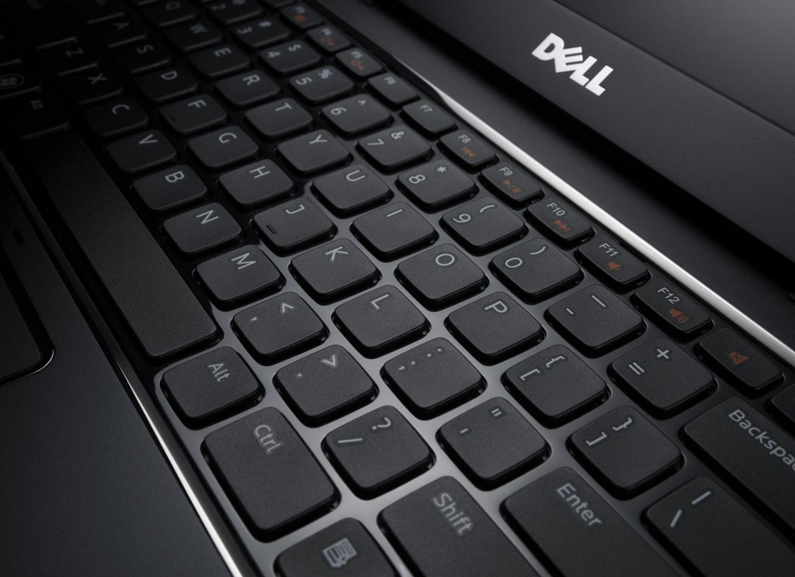

# 外设
对于笔记本而言，外设无非也就是输入，输出设备，大抵也就是键盘，触摸板，摄像头，USB接口，HDMI 接口等等了。

对于笔记本而言，键盘和触摸板是最主要的两个输入设备，键盘的质量和功能和工作效率正相关。

对于键盘和触摸板，大多数的笔记本都是大同小异，唯一值得一提的就是 PC 机中 ThinkPad 独特的小红点，和 Macbook 特有的触摸板。

对于当前想要选购笔记本的用户对于键盘已经没有多少选择的余地了，大部分的笔记本厂商已经只使用巧克力键盘，所以不管是之前使用过其他键盘的用户，都无法避免需要去适应这一类型的键盘。

另外有些笔记本会给键盘一个键盘灯，大部分情况下键盘灯的作用是很微小的，而如果你是在学习或者容易断电的地方，那么一个键盘灯可以让你持续工作，这就需要考虑是否在选购时选择带有键盘灯的电脑。

## 键盘
键盘作为笔记本最主要的输入工具，占据用户大量使用电脑的时间，下面就从键盘的布局讲述下笔记本键盘的发展历史。

### 键盘的布局
键盘的布局对于输入来说非常重要，而市面上笔记本的键盘基本上都是相差不多。如果非要看区别，一个就是 Windows 徽标的键和 Fn 功能键，不同品牌的电脑可能设计上会略有差别。

近年来越来越多的笔记本厂商将降低和提高音量，改变屏幕亮度等功能键涉及到 F1-12 按键上。对于经常使用 F1-12 功能键的用户，如果默认情况需要安装 Fn 来触发，那么会带来非常大的困扰。

另外比如 Home ，End，PgUp，PgDown，PrintScreen 等等按键虽然平时可能使用也比较少，但是也可以注意一下。

### 传统键盘
Traditional Keyboard 或者称为 Classic Keyboard，传统风格的键盘键帽边缘会有一定的倾斜，键与键之间大概只有1毫米的间隔。

比如下面 ThinkPad 中使用的键盘

这种键盘如今已经很少在笔记本上见到，大部分已经被巧克力键盘和浮岛键盘所取代。

传统键盘的优点就是让从老旧笔记本切换过来的用户不用适应新的键盘，传统键盘通常位于托盘中，用户能够轻易的完全取出并更换。

传统键盘的另外一个好处就是它的键程要比巧克力键盘长，往往键程比较长给人的触觉反馈更好。

不好之处就是传统键盘难以清理，没有办法轻易的清理键与键之间的缝隙。

### Chiclet 键盘
Chiclet 键盘，俗称的巧克力键盘，这种键盘通常的特点是按键表面是平的，并且键与键之间有额外的间距。这种键盘又被称为 悬浮键盘（floating keyboard），或者也被称为 孤岛键盘（island-style keyboard），

网上的说法是，设计风格上这种巧克力键盘更具现代风格，在笔记本设计中也可以将笔记本设计更加轻薄。

Chiclet 键盘仍然会在键帽之下积累灰尘和污垢，但是巧克力键盘要比传统键盘更加容易清理。

巧克力键盘的触觉反馈差异很大，超薄笔记本中体验最差，因为这些笔记本为了设计得更加薄，所以减少了键盘的键程，所以这也是 Macbook 新款键盘广受吐槽的一点。但是也有一些品牌的巧克力键盘有非常不错的触感。

优点：

- 不错的外观设计
- 容易清理

缺点：

- 设计影响了敲击按键的舒适性

### 机械键盘
机械键盘在笔记本电脑上非常少见，除了一些极端的游戏本，很少厂商会将机械键盘设计到笔记本电脑上。这本就已经和笔记本电脑便携产生了矛盾。不过不妨碍我们了解机械键盘。

多数笔记本电脑都是使用的薄膜键盘，没有机械的动作，而机械键盘在每个按键下都有一个机械装置，这样的机械装置使得敲击键盘的触感得到了提升。如果你从事文字工作，那么强烈建议你在购买笔记本之余选购一个机械键盘。

### 触觉反馈键盘
这种类型的键盘没有物理按键，每个“键”仅通过触摸或按下来激活。从本质上讲，触摸或按压的表面不会通过物理运动做出反馈。如果键盘有触觉反馈，它会发出轻微的震动或嗡嗡声，让你知道你已经激活了一个按键。类似与 苹果在手机端引入的非实体HOME 键。

尽管联想在 2016 年就发不过相关的产品，但是无法弥补他的缺陷。

引用媒体的评价

“虽然它看起来很神奇，但感觉真的是一个糟糕的替代品。在它上面打字缓慢而笨拙。如果没有物理按键，你可以盲目地点击你认为按键的位置。这可以通过一些练习和集中精神，从而精确地输入字母，但是使用较小的标点符号键和Shift 键组合很尴尬。触摸打字是不可能的，用食指点击只比屏幕上的选择稍微好一点。“[^touch]

优点：

- 当使用平板设备时比较方便

缺点：

- 没有物理触觉几乎无法舒适地输入

### 总结
巧克力键盘几乎成为了现在笔记本的主流方案，它在过去几年里完全取代了传统键盘，机械键盘只出现在少量的 MSI 和 联想游戏本中，但是在笔记本中没有普及，也不会普及。触摸或者触觉的键盘可以用在平板电脑上，但是通常不能作为笔记本电脑的主要输入设备。

巧克力键盘对行业发展造成的影响不能说好，也不能说坏，巧克力键盘能否提供良好的打字体验并不依赖于单一的因素，两个风格相同的键盘可能完全有不一样的感觉。

所以建议如果在不确定键盘是否舒适时，尽量在购买前试用一段时间的键盘。

## 触摸板
对于PC机的触摸板，大多体验都相差无几，最多在功能上略有差异，双指或者三指操作。

对于 MacBook 的触摸板可能是领先 PC 很多很多的了。

另外要说的就是 ThinkPad 系列的小红点，以一个操作杆代替鼠标的滑动，这个想法是非常不错的。

## 接口
虽然现在的笔记本越做越薄，越做越小，但是我认为的 USB，HDMI 接口是必须的。

这也就是我无法看好苹果接口的一大原因，虽然不得不说苹果在接口方面的创新，但是在市场普遍还没有接受的情况下，如果牺牲了接口的便捷性而需要携带各种接口转换设备，那么对于便携来说就是一个灾难。

## reference

- <http://www.notebookreview.com/feature/laptop-keyboards-explained-best-worst-keyboard-tech/>

[^touch]: http://www.notebookreview.com/feature/laptop-keyboards-explained-best-worst-keyboard-tech/