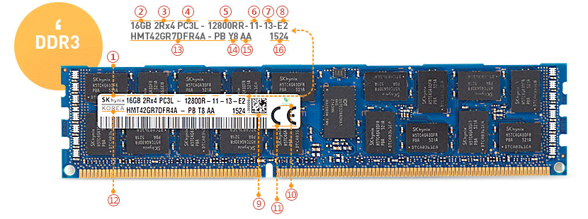
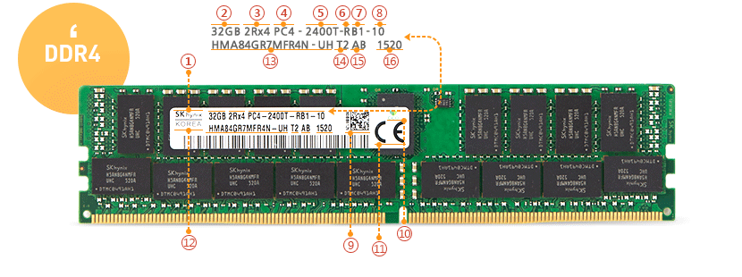

# 内存
内存也被称为内存储器，可以叫做 RAM（Random-access memory)，其作用是用于暂时存放CPU中的运算数据，以及与硬盘等外部存储器交换的数据，内存是外界与CPU进行沟通的桥梁。早期的内存是焊接在主板上的，随着计算机模块化发展，用户自行更换内存的需求导致可可更换内存的出现。于是早期出现了 SIMM（Single In-lineMemory Modules）规格的内存，SIMM的成功证明了内存可更换设计的重要性，所以接着出现了 SDRAM，DDR SDRAM（Dual Date Rate SDRAM），也就是现在 DDR 标准，如果对内存发展历史感兴趣可以参考[这篇](https://zhuanlan.zhihu.com/p/34414738)文章。

对于内存条的发展而言，2018年最少应该用上 8G 了。通常情况下如果笔记本电脑可以支持两条内存插槽，那么买回后自己再配一条内存装上要比买16G，或者更高 32 G 整装的笔记本来的要实惠。而对于不可拆卸的超极本，或者 Mac，那么就只能买出厂时的内存配置了。

当前内存条需要注意的是 DDR4 和 DDR3 不兼容的情况，注意下图中接口金手指部分

在 ddr4 中金手指部分有一定的弧度，并且缺口部分位置也和 ddr3 部分不一样。这是故意设计，为了防止不同代接口的内存条插错可能引起的问题。

但是同一代产品之间，不同品牌的内存条是可以混用的，频率不相同，内存条会自动在运行时向下看齐。

下面的内容感兴趣可以继续往下读，但是对于购买只需要了解内存大小，频率基本已经足够了。

## 容量
内存条的容量是最直观的表现，通常情况下如果要运行大型程序，游戏，专业软件，内存容量当然越大越好。

## 频率

同一代的 DDR 内存条的外观和接口是一样的，相互兼容，可以共用。如果同一代的内存条频率不同，同时使用时高频率的内存条要迁就低频率的内存条。

内存条的工作频率和主板相关，如果超出主板支持的频率，则主板最大使内存条的运行频率降为主板支持的最大频率，比如主板支持频率为1333MHz的内存条，买了最高频率为1600MHz的内存条，电脑也会把1600MHz的内存条当做1333MHz的内存条来用。

目前主流的内存条频率：

- DDR3： 800、1066、1333、1600、1866
- DDR4： 2133、2400、2666、3200、3600

## Single Sided DIMM vs Double Sided DIMM
SIMM 时代内存位宽是 32bit，后来随着处理器升级，SIMM 也变成了 DIMM（Double-Inline Memory Module），位宽可以支持64 bit ，也就是 8 字节。这个标准直至今天，但是随着内存发展又延伸出 Single Side DIMM 和 Double Side DIMM，

从直观上来说，通常内存条是只有一面有八块颗粒，每一个颗粒 8 bit，通常标记为 1Rx8，还有一种内存条，每一面都有八块内存颗粒，而每个颗粒是 4 bit，这是被记做 1Rx4。

另外一种内存两面都有八块内存颗粒，那么在内存标记上会被记做 2Rx8。

所以 Single Sided 和 Double Sided 只需要简单的看内存颗粒的分布是一面还是两面，但是标记中的的 R 表示的是 Rank， Rank 并不能直接从外观看出来。所以要介绍一下 memory rank 的概念。

## memory rank
我们看到的物理内存条，上面一般会有八块黑色的内存颗粒，这些颗粒叫做 chip，每一个 chip 负责固定 4 bit 或者 8 bit 存储，组合一起 64 bit 称为一个 rank。

所以如果单面八块 8 bit 的颗粒，那么单面就组成一个 rank，如下图

如果两面都有八块 8 bit 的颗粒，那么每一面都是 64 bit 位宽，这样的内存条会被标记为 2Rx8。也就是这样的内存条会有 rank0 和 rank1。

## memory bank
在上面提到的 chip 中，每块 chip 都包含 8 个 bank，bank 是数据存储的实体，bank 可以想象为一个二维矩阵，通过 column 和 row 可以从 bank 中获取 8 bit 的数据。

CPU在一个传输周期能接收的数据容量就是CPU数据总线的位宽，以目前主流的DDR系统为例，CPU与内存之间的接口位宽是64bit，也就意味着CPU在一个周期内会向内存发送或从内存读取64bit的数据，那么这一个64bit的数据集合就是一个内存条Bank。

由于内存这样的结构所以内存可以做到快速随机存储。

## 解读内存标签含义

在 DDR3 内存标签上,  一般参数描述为: `ggg eRxff-PC3-wwwwwm-aa-bb-cc`

- ggg 表示的是内存总容量，比如 2GB，4GB，8GB
- e 是 ranks 的数量
 
    1 = single-rank 
    2 = dual-rank
    4 = quad-rank
      
- ff 每一快 chip 颗粒的 bit 宽度，设备组织形式

    4 = x4 organization (4 DQ lines per SDRAM)
    8 = x8 organization

- wwwww 表示的是 DIMM 带宽, 单位是 MBps
  
    6400 = 6.40 GBps (PC3-800 SDRAMs, 8-byte primary data bus)
    8500 = 8.53 GBps (PC3-1066 SDRAMs, 8-byte primary data bus)
    10600 = 10.66 GBps (PC3-1333 SDRAMs, 8-byte primary data bus)
    12800 = 12.80 GBps PC3-1600 SDRAMs, 8-byte primary data bus)

- m 表示 DIMM type

    E = Unbuffered DIMM (UDIMM) with ECC (x72-bit module data bus)
    R = Registered DIMM (RDIMM)
    U = Unbuffered DIMM with no ECC (x64-bit primary data bus)

- aa 表示 CAS 等待时间，以最大运行频率时的时钟数表示 CAS latency, in clocks at maximum operating frequency
- bb 表示 JEDEC SPD Revision Encoding and Additions level
- cc 表示 reference design file for the design of the DIMM

上面这一条 DDR3 内存条，通常情况下 PC3 可能会替换为 `DDR3` 或者 `PC3L` 或者 `PC3U`

- `DDR3` 或者 `PC3` 是标准电压版，在 1.50V 电压运行（符合 JEDEC 标准）
- `DDR3L` 或者 `PC3L` 是低电压版，在 1.35V 运行（符合 JEDEC 标准）。低电压版相较于普通电压的内存，工作时性能会略低，但更重要的是功耗也更低。一般情况下，L版本的内存只应用于笔记本、服务器、一体机等便携或有能耗要求的设备上，台式电脑尤其是游戏用主机很少出现，毕竟其存在的意义是节省功耗延长续航
- `DDR3U` 或者 `PC3U` 是超低电压版（Ultra Low Voltage）在 1.25V 运行（不符合 JEDEC 标准）

参考[Stackoverflow](https://superuser.com/a/662042/298782)

根据上面的规则，来看下这一条内存条标签中的内容：

比如：

    16GB 2Rx4 PC3L  12800R-11-13-E2
    
解释：

- 16GB 容量大小
- 2 rank 每个 chip 颗粒为 4 bit
- PC3L 表示 低电压版本
- 12800R 表示 Registered DIMM 带宽为 12.8GBps

或者 

ddr4 标签类似，但是 ddr4 ，或者 pc4 后面接的标签内容通常为 `2400P` 或者 `2400T` 主要区别在时序，可以参考[Wiki](https://en.wikipedia.org/wiki/DDR4_SDRAM#Modules)，这部分内容太深入略过。

## reference

- <https://www.anandtech.com/show/3851/everything-you-always-wanted-to-know-about-sdram-memory-but-were-afraid-to-ask/2>
- <https://www.youtube.com/watch?v=L9uLzv5TZcY>
- <http://lzz5235.github.io/2015/04/21/memory.html>